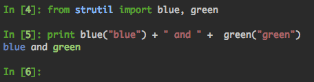
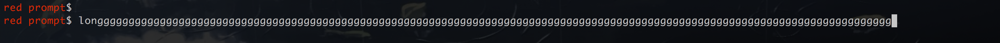
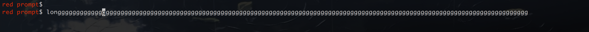
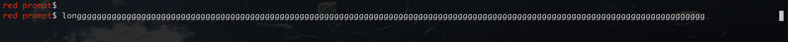
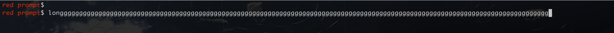
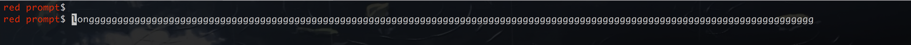
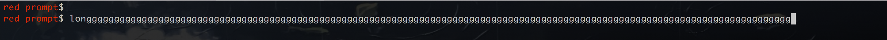

<!-- START doctoc generated TOC please keep comment here to allow auto update -->
<!-- DON'T EDIT THIS SECTION, INSTEAD RE-RUN doctoc TO UPDATE -->
#   Table of Content

- [Name](#name)
- [Status](#status)
- [Synopsis](#synopsis)
  - [colored string](#colored-string)
  - [colored command prompt](#colored-command-prompt)
- [Classes](#classes)
  - [strutil.ColoredString](#strutilcoloredstring)
    - [ColoredString.join](#coloredstringjoin)
    - [ColoredString.split](#coloredstringsplit)
    - [ColoredString.splitlines](#coloredstringsplitlines)
  - [strutil.TrieNode](#strutiltrienode)
    - [TrieNode.n](#trienoden)
    - [TrieNode.char](#trienodechar)
    - [TrieNode.outstanding](#trienodeoutstanding)
    - [TrieNode.is_outstanding](#trienodeis_outstanding)
  - [strutil.Hex](#strutilhex)
    - [Hex instance attributes](#hex-instance-attributes)
- [Methods](#methods)
  - [strutil.break_line](#strutilbreak_line)
  - [strutil.color](#strutilcolor)
  - [strutil.colorize](#strutilcolorize)
  - [strutil.common_prefix](#strutilcommon_prefix)
  - [strutil.line_pad](#strutilline_pad)
  - [strutil.make_trie](#strutilmake_trie)
  - [strutil.format_line](#strutilformat_line)
  - [strutil.page](#strutilpage)
  - [strutil.sharding](#strutilsharding)
  - [strutil.struct_repr](#strutilstruct_repr)
  - [strutil.format_table](#strutilformat_table)
  - [strutil.filter_invisible_chars](#strutilfilter_invisible_chars)
  - [strutil.tokenize](#strutiltokenize)
  - [strutil.parse_colon_kvs](#strutilparse_colon_kvs)
- [Author](#author)
- [Copyright and License](#copyright-and-license)

<!-- END doctoc generated TOC please keep comment here to allow auto update -->

#   Name

strutil

It provides with several string operation functions.

#   Status

This library is considered production ready.

#   Synopsis

```python
from pykit import strutil

lines = [
    'hello',
    'world',
]

# add left padding to each line in a string
strutil.line_pad('\n'.join(lines), ' ' * 4)
# "    hello"
# "    world"


# format a multi-row line
items = [ 'name:',
          [ 'John',
            'j is my nick'
          ],

          'age:',
          26,

          'experience:',
          [ '2000 THU',
            '2006 sina',
            '2010 other'
          ],
]

strutil.format_line(items, sep=' | ', aligns = 'llllll')
# outputs:
#    name: | John         | age: | 26 | experience: | 2000 THU
#          | j is my nick |      |    |             | 2006 sina
#          |              |      |    |             | 2010 other
```

## colored string

```python
from pykit.strutil import blue
from pykit.strutil import green
blue("blue") + " and " + green("green")
```

The above snippet will output colored text on a terminal:



## colored command prompt

If you are going to use colored string as terminal prompt,
the terminal prompt is not wrapping correctly with very long commands.
You'd better tell **ColoredString** that is a prompt color string.

```python
from pykit.strutil import ColoredString
prompt = ColoredString('colored prompt# ', color='red', prompt=True)
```

Those screenshots show this issue, the cursor is box.

`prompt=False` long command:



`prompt=False` long command after **Home Key**:



`prompt=False` long command after **End Key**:



`prompt=True` long command:



`prompt=True` long command after **Home Key**:



`prompt=True` long command after **End Key**:



#   Classes

## strutil.ColoredString

**syntax**:
`strutil.ColoredString(normal_string, color=None, prompt=True)`

It provides the colored string in terminal on Unix.

**arguments**:

-   `normal_string`:
    the string to colour.

-   `color`:
    the color of **normal_string**,
    named color are:
    `blue` `cyan` `green` `purple` `red` `white` `yellow`
    `optimal` `normal` `loaded` `warn` `danger`,

    you can colour string with integer [0-256].

**return**:
An instance of strutil.ColoredString.

### ColoredString.join

**syntax**:
`ColoredString.join(iterable)`

Return a ColoredString instance which is the concatenation of the elements in
`iterable`, the separator between elements is the instance providing this method.
It does not change color of the element. String element has no color in the result.

**arguments**:

-   `iterable`:
    an iterable whose elements are string values or ColoredString instances.

**return**:
An instance of strutil.ColoredString.

### ColoredString.split

**syntax**:
`ColoredString.split([sep[, maxsplit]])`

Return a list of the colored words in the ColoredString. If `maxsplit` is given, at most
`maxsplit` splits are done. If `maxsplit` is not specified or -1, then there is
no limit on the number of splits.

If `sep` is given, consecutive delimiters are not grouped together and are
deemed to delimit empty strings. The `sep` argument may consist of multiple
characters. Splitting an empty ColoredString with a specified separator returns
`[ColoredString('')]`.

If `sep` is not specified or is `None`, a diffrent splitting algorithm is
applied: runs of consecutive whitespace are regarded as a single separator, and
the result will contain no empty strings at the start or end if the string has
leading or trailing whitespace. Consequently, splitting an empty string or a
string consisting of just whitespace with a `None` separator returns `[]`.

Works just like `str.split`.

For example:
```
#[ColoredString('hello'), ColoredString('pykit')]
ColoredString(' hello  pykit ').split()

#[ColoredString('hello', 'red'), ColoredString('pykit', 'blue')]
color = ColoredString('hello<', 'red') + ColoredString('>pykit', 'blue')
color.split('<>')

#[ColoredString('hel', 'red'), ColoredString('lo<', 'red')+ColoredString('>pykit', 'blue')]
color = ColoredString('hel<>lo<', 'red') + ColoredString('>pykit', 'blue')
color.split('<>', 1)
```

**arguments**:

-   `sep`:
    is the delimiter to split the ColoredString. Optional. If `sep` is not
    specified or is None, then runs of consecutive whitespace are regarded as
    a single separator.

-   `maxsplit`:
    is the number of splits. Optional. If `maxsplit` is not specified or -1, then there is
    no limit on the number of splits.

**return**:
a list of the colored words.

### ColoredString.splitlines

**syntax**:
`ColoredString.splitlines([keepend])`

Return a list of the lines in the ColoredString, breaking at line boundaries.
This method recognizes `"\r"`, `"\n"` and `"\r\n"` as line boundaries. Line
breaks are not included in the resulting list unless `keepend` is given and true.

Works just like `str.splitlines`.

For example:
```
#[ColoredString('hello'), ColoredString('pykit')]
ColoredString('hello\npykit').splitlines()

#[ColoredString('hello\n', 'red'), ColoredString('pykit\n', 'blue')]
color = ColoredString('hello\n', 'red') + ColoredString('pykit\n', 'blue')
color.splitlines(true)
```

**arguments**:

-   `keepend`:
    is a bool. If `keepend` is given and true, then line breaks are included in
    the resulting list. Optional.

**return**:
a list of the lines in the ColoredString, breaking at line boundaries.

##  strutil.TrieNode

**syntax**:
`strutil.TrieNode()`

`TrieNode` is a sub class of `dict` to represent a node in trie.

It has the same `__init__` as `dict`.

See `strutil.make_trie`.


### TrieNode.n

Total number of items with the prefix represented by this node.  `None` means
there might be more items with this prefix thus its number can not be decided
yet.


### TrieNode.char

Trie branch key, a single char


### TrieNode.outstanding

An outstanding node is a node that there might be more following input string
which has its corresponding prefix.

This attribute points to the last added child node.


### TrieNode.is_outstanding

If this node is an outstanding node to its parent node.  When created, a node
must be an outstanding node.


##  strutil.Hex

**syntax**:
`strutil.Hex(data, byte_length)`

Create a `str` based instance that represents a fixed-length hex string,
to simplify hex and arithmetic operations.

An `Hex` instance supports arithmetic operations: `+ - * / % **`.

NOTE: **it overrides native `str` operation such as `str + str`**.

**arguments**:

-   `data`:
    can be a `str`, `int` or tuple in form of `(<prefix_hex>, <filling_byte>)`

-   `byte_length`:
    specifies number of bytes for this hex.
    It can not be changed after creating it.

    > byte length x 2 = hex length

    It also can be a symblic name: `crc32`, `md5`, `sha1` or `sha256`.

**Synopsis**:

```python
from pykit.strutil import Hex


# Different ways to create a 4-byte crc32 hex str

Hex(0x0102, 4)           # 00000102
Hex(0x0102, 'crc32')     # 00000102
Hex.crc32(0x0102)        # 00000102
Hex('00000102', 'crc32') # 00000102
Hex.crc32('00000102')    # 00000102


# Create with a tuple of prefix and a filling byte

Hex(('12', 1), 'crc32')  # 12010101


# Arithmetic operations

c = Hex(0x0102, 'crc32')
d = c + 1
print type(d), d         # <class 'pykit.strutil.hex.Hex'> 00000103
print repr(c*2)          # '00000204'
print c - 1000000        # 00000000 # overflow protection
print c * 1000000        # ffffffff # overflow protection


# Iterate over sha1 space with a specific step:

c = Hex.sha1(0)
step = Hex.sha1(('10', 0))
for i in range(16):
    print c
    c += step

# 0000000000000000000000000000000000000000
# 1000000000000000000000000000000000000000
# 2000000000000000000000000000000000000000
# 3000000000000000000000000000000000000000
# 4000000000000000000000000000000000000000
# 5000000000000000000000000000000000000000
# 6000000000000000000000000000000000000000
# 7000000000000000000000000000000000000000
# 8000000000000000000000000000000000000000
# 9000000000000000000000000000000000000000
# a000000000000000000000000000000000000000
# b000000000000000000000000000000000000000
# c000000000000000000000000000000000000000
# d000000000000000000000000000000000000000
# e000000000000000000000000000000000000000
# f000000000000000000000000000000000000000

```

###  Hex instance attributes

-   `Hex.hex`: a plain string of hex `'00000102'`.
-   `Hex.bytes`: a plain string of bytes `'\0\0\1\2'`.
-   `Hex.int`: a int value `0x0102` same as `int('00000102', 16)`.
-   `Hex.byte_length`: number of bytes in `Hex.bytes`.


#   Methods


##  strutil.break_line

**syntax**:
`strutil.break_line(linestr, width)`

Split `linestr` to lines by one space or line break
to make length of every line no greater than `width`.

Only one space or line break is replaced at a time. Any others stay.

If `linestr` is a ColoredString instance, color of non-blank chars do not change.

Examples:
```
strutil.break_line('foo bar bar.', 9)
#['foo bar', 'bar.']

print strutil.break_line('one   two  three', 4)
#['one ', ' two', '', 'three']

strutil.break_line(ColoredString('foo bar ', 'blue') + ColoredString('bar.', 'red'), 9)
#[ColoredString('foo', 'blue') + ColoredString(' ') + ColoredString('bar', 'blue'), ColoredString('bar.', 'red')]
```

**arguments**:

-   `linestr`:
    is a string or a ColoredString instance.

-   `width`:
    is the longest line length expected after being split.
    If `width` is negative, get the same result as `width` is 0.
    And if `width` is a float, just integer part is used.

**return**:
A list filled with lines of split `linestr`.

##  strutil.color

**syntax**:
`strutil.<color>(str)`

Create colored string to use in terminal.

```python
t = strutil.blue("blue-text")
```

Supported operation on colored string `t`:

```python
# concatenate with other colored string:
t + strutil.green("green-text")

# concatenate with plain string:
t + "a"

# repeat:
t * 3

# length:
len(t)
```

Supported color names:

-   `blue`
-   `cyan`
-   `green`
-   `yellow`
-   `red`
-   `purple`
-   `white`
-   `optimal` same as `blue`
-   `normal` no color
-   `loaded` same as `green`
-   `warn` same as `dark yellow`
-   `danger` same as `red`

## strutil.colorize

**syntax**:
`strutil.colorize(percent, total=100, ptn='{0}')`

Colorize a percentage number.

Synopsis:

```python
from pykit.strutil import colorize

# the color of p printed: blue -> green -> yellow -> red
for p in xrange(0, 100):
        print colorize(p, 100),
        print

# the color of p printed: red -> yellow -> green -> blue
for p in xrange(0, 100):
        print colorize(p, -100),
        print

# the color of p printed is red if p>=10
for p in xrange(0, 100):
        print colorize(p, 10),
        print

# the color of p printed is blue if p>=10
for p in xrange(0, 100):
        print colorize(p, -10),
        print

# 'the percent is: 100' with red
print colorize(100, 100, 'the percent is: {0}')

# ' 22%' with green
print colorize(22, 100, '{0:>3}%')
```

**arguments**:

-   `percent`:
    the percent to colour.

-   `total`:
    the limitation of **percent** to colour.
    negative integer means to reverse.

-   `ptn`:
    the format of **percent**.

**return**:
A colored formatted percent string.


##  strutil.common_prefix

Find common prefix of several `string`s, tuples of string, or other nested
structure, recursively by default.
It returns the shortest prefix: empty string or empty tuple is removed.

**Synopsis**:

```python
from pykit import strutil

strutil.common_prefix('abc', 'abd')                   # 'ab'
strutil.common_prefix((1, 2, 'abc'), (1, 2, 'abd'))   # (1, 2, 'ab')
strutil.common_prefix((1, 2, 'abc'), (1, 2, 'xyz'))   # (1, 2); empty prefix of 'abc' and 'xyz' is removed
strutil.common_prefix((1, 2, (5, 6)), (1, 2, (5, 7))) # (1, 2, (5,) )
strutil.common_prefix('abc', 'abd', 'abe')            # 'ab'; common prefix of more than two
strutil.common_prefix((1, 2, 'abc'), (1, 2, 'abd'), recursive=False) # (1, 2)
```

**syntax**:
`strutil.common_prefix(a, *others, **options)`

**arguments**:

-   `a` and element in `others`:
    are `string`, `tuple` or `list` to find common prefix of them.
-   if field `recursive` in `options` is set to `False`, it will run non-recursively.

**return**:
a common prefix of the same type of `a`.


## strutil.line_pad

**syntax**:
`strutil.line_pad(linestr, padding)`

**arguments**:

-   `linestr`:
    multiple line string with `\n` as line separator.

-   `padding`:
    left padding string to add before each line.

    It could also be a callable object that returns a string.
    This is useful when creating dynamic padding.

**return**:
multiple line string with `\n` as line separator, with left padding added.


##  strutil.make_trie

**syntax**:
`strutil.make_trie(sorted_iterable, node_max_num=1)`

Make a [trie](https://en.wikipedia.org/wiki/Trie) from a series of strings.
It also tries to squash (at most `node_max_num`) leaf nodes to an ancestor to
reduce memory usage.
Thus when using it to calculate strings distribution, it achieves accuracy in
the unit of `node_max_num`.

Building a trie is in `O(n)` time cost, where `n` is total numbers of chars in
the input.

**Synopsis**:

```python
from pykit import strutil
t = strutil.make_trie(
        (
            'abc',
            'abcdef',
            'abcdeg',
            'abcdfg',
            'abd',
            'abe',
            'axy',
            'b11',
            'b12',
            'b123',
            'b14',
        ), node_max_num=3)

print str(t)
# 11:  a,7:  b,6:  c,4:  d,3
#                  d,1
#                  e,1
#            x,1
#      b,4:  1,4:  1,1
#                  2,2
#                  4,1
print str(t['a'])
# a,7:  b,6:  c,4: d,3
#             d,1
#             e,1
#       x,1
```

**arguments**:

-   `sorted_iterable`:
    is an iterable(`list`, `tuple`, `generator` or else) of strings or other
    comparable elements.
    Sample of valid `sorted_iterable`:

    ```
    sorted_iterable = ['abc', 'abd', ]

    sorted_iterable = ('abc', 'abd', )

    sorted_iterable = [(1, 'x'), (1, 'y'), ]

    def gen():
        for i in range(3):
            yield (i,)
    sorted_iterable = gen()
    ```

    Elements in it must be sorted ascending or descending.

-   `node_max_num`:
    specifies the maximum number of strings a leaf node can have.
    If total number of all the leaf nodes of a parent node smaller or equal
    `node_max_num`, it squash leaf nodes to their parent.

**return**:
a `TrieNode` instance, which is the root of a trie.


## strutil.format_line

**syntax**:
`strutil.format_line(elts, sep=' ', aligns='')`

It formats a list in a multi row manner.

It is compatible with colored string such as those created with `strutil.blue("blue-text")`.

```python
strutil.format_line([1, "a:", "b"], sep=" | ")
# "1 | a: | b"

strutil.format_line([["name:", "age:"], ["drdrxp", "18"], "wow"], sep=" | ", aligns="rll")
# "name: | drdrxp | wow"
# " age: | 18     |"
```

**arguments**:

-   `elts`:
    elements in a line.
    Each element could be a `string` or a `list` of `string`.
    If it is a `list` of `string`, it would be rendered as a multi-row
    element.

-   `sep`:
    specifies the separator between each element in a line.
    By default it is a single space `" "`.

-   `aligns`:
    specifies alignment for each element.
    -   `l` for left-align.
    -   `r` for right-align.

    If no alignment specified for i-th element, it will be aligned to right by
    default.

**return**:
formatted string.


##  strutil.page

**syntax**:
`strutil.page(lines, max_lines=10, control_char=True, pager=('less',))`

Display `lines` of string in console, with a pager program (`less`) if too many
lines.

It could be used in a interactive tool to display large content.

It output strings directly to stdout.

**arguments**:

-   `lines`:
    is `list` of lines to display.

-   `max_lines`:
    specifies the max lines not to use a pager.

    By default it is 10 lines.

-   `control_char`:
    specifies if to interpret controlling chars, such as color char in terminal.

-   `pager`:
    specifies the program as a pager.

    It is a list of command and argument.

    By default it is `('less',)`.

**return**:
Nothing.


##  strutil.sharding

**syntax**:
`strutil.sharding(sorted_iterable, size, accuracy=None, joiner=''.join)`

Split `sorted_iterable` into segments, each one of those contains
`size` to `size + accuracy` strings, except the last one.

Time complexity is `O(n)`, where `n` is the total number of chars in all strings.
It uses a trie as underlying storage to track string distribution.
See `strutil.make_trie`.

It returns a list of tuples contains start key and segment size.

-   The start key is a prefix of one of `sorted_iterable`.
    If `sorted_iterable` is a list of strings, start key is a prefix string.
    If `joiner` is specified, start key is constructed with `joiner`.

-   A start key are always shortened to the minimal size.

-   The first start key is always `None`.

-   The smaller `accuracy` is, the more memory is cost, because it need to track
    more distribution information during scanning the strings.
    `accuracy=1` let it track every single char in all strings.

```python
from pykit import strutil
with open('words.txt') as f:
    lines=f.readlines()
    lines=[x.strip() for x in lines]

print strutil.sharding(lines, size=200, accuracy=20)
# [
#     (None    , 209, ),
#     ('M'     , 202, ),
#     ('TestU' , 202, ),
#     ('br'    , 202, ),
#     ('dc'    , 201, ),
#     ('exi'   , 202, ),
#     ('inf'   , 204, ),
#     ('may'   , 205, ),
#     ('pf'    , 200, ),
#     ('rew'   , 208, ),
#     ('suc'   , 204, ),
#     ('wh'    , 56,  ),
# ]
```

**arguments**:

-   `sorted_iterable`:
    an iterable of strings, it can be a `list`, `tuple` or `generator`.
    **All strings in it must be sorted**.

-   `size`:
    specifies the expected minimal segment size.

-   `accuracy`:
    specifies the acceptable variance of segment size.
    The result segment size is between `size` and `size + accuracy`.

    By default it is `size / 10`

-   `joiner`:
    specifies what function to use to reconstructe a sharding key from trie-node-path.

    By default it reconstruct a string from a list of chars.

    To generate `tuple` sharding keys: use `strutil.sharding(.., joiner=tuple)`.

**return**:
a list of tuple.


##  strutil.struct_repr

**syntax**:
`strutil.struct_repr(d, key=None)`

Render primitive or composite data to a structural representation string
list.

```python
a = {
    1: 3,
    'x': {1:4, 2:5},
    'l': [1, 2, 3],
}
for l in strutil.struct_repr(a):
    print l

# 1 : 3
# l : - 1
#     - 2
#     - 3
# x : 1 : 4
#     2 : 5
```

**arguments**:

-   `d`:
    a number, string, list or dict to render to a structural
    representation.

-   `key`:
    is a callable that is used to sort dict keys.

    It is used in sort: `keys.sort(key=key)`.

**return**:
a list of string.

##  strutil.format_table

**syntax**:
`strutil.format_table(rows, keys=None, colors=None, row_sep=None, sep=' | ')`

Render a list of data into a table.

Number of rows is `len(rows)`.
Number of columns is `len(rows[0])`.


```python
inp = [
    {'acl': {},
     'bucket': 'game1.read',
     'bucket_id': '1400000000000689036',
     'num_used': '0',
     'owner': 'game1',
     'space_used': '0',
     'ts': '1492091893065708032'},
    {'acl': {},
     'bucket': 'game2.read',
     'bucket_id': '1510000000000689037',
     'num_used': '0',
     'owner': 'game2',
     'space_used': '0',
     'ts': '1492091906629786880'},
    {'acl': {'imgx': ['READ', 'READ_ACP', 'WRITE', 'WRITE_ACP']},
     'bucket': 'imgx-test',
     'bucket_id': '1910000000000689048',
     'num_used': '0',
     'owner': 'imgx',
     'space_used': '0',
     'ts': '1492101189213795840'}]

for l in strutil.format_table(inp, row_sep='-'):
    print l

# acl:               | bucket:    | bucket_id:          | num_used:  | owner:  | space_used:  | ts:
# -----------------------------------------------------------------------------------------------------------------
# {}                 | game1.read | 1400000000000689036 | 0          | game1   | 0            | 1492091893065708032
# -----------------------------------------------------------------------------------------------------------------
# {}                 | game2.read | 1510000000000689037 | 0          | game2   | 0            | 1492091906629786880
# -----------------------------------------------------------------------------------------------------------------
# imgx : - READ      | imgx-test  | 1910000000000689048 | 0          | imgx    | 0            | 1492101189213795840
#        - READ_ACP  |            |                     |            |         |              |
#        - WRITE     |            |                     |            |         |              |
#        - WRITE_ACP |            |                     |            |         |              |

# customize column header:
for l in strutil.format_table(inp, keys=[['bucket', 'Bkt'],
                                         ['num_used', 'n']]):
    print l

# Bkt:       | n:
# game1.read | 0
# game2.read | 0
# imgx-test  | 0
 ```

**arguments**:

-   `rows`:
    list of items to render.

    Element of list can be number, string, list or dict.

-   `keys`:
    specifies indexes(for list) or keys(for dict) to render.
    It is a list.

    Indexes or keys those are not in this list will not be rendered.

    It can also be used to specify customized column headers, if element in
    list is a 2-element tuple or list:

    ```
    keys = [
        ('bucket', 'Bkt'),
        ('num_used', 'n'),
        'bucket_id',
    ]
    # It output a talbe like below:
    # Bkt:       | n: | bucket_id:
    # game1.read | 0  | ...
    ```

-   `colors`:
    specifies the color for each column.
    It is a list of color values in number or color name strings.

    If length of `colors` is smaller than the number of columns(the number of
    indexes of a list, or keys of a dict), the colors are repeated for columns
    after.

-   `row_sep`:
    specifies char to separate rows.

    By default it is None, it means do not add line separator.

-   `sep`:
    specifies column separator char.

    By default it is `" | "`.

**return**:
a list of string.


##  strutil.filter_invisible_chars

**syntax**:
`strutil.filter_invisible_chars(data)`

Filters invisible characters in a string or a unicode object

```python
from pykit.strutil import filter_invisible_chars

cases = [
            "1273883926293937729\000\001\031",
            "\x00\x01\x02\x03\x04\005",
            u"1122299299299299292",
            u"\x00\x01\x02\x03\x04\005",
]

rst = []
for case in cases:
    rst.append(strutil.filter_invisible_chars(case))

for r in rst:
    print r

#'1273883926293937729'
#''
#u'1122299299299299292'
#u''
```

**arguments**:

-   `data`:
    a string or unicode object to filter invisible characters

**return**:
a filtered string or unicode object

## strutil.tokenize

**syntax**:
`strutil.tokenize(linestr, sep=None, quote='"\'', preserve=False)`

Tokenize a line.

Synopsis:

```python
from pykit.strutil import tokenize

# ['ab']
print tokenize('ab')

# ['a', 'b']
print tokenize('a b')

# ['a', 'b']
print tokenize(' a  b ')

# ['a', 'b']
print tokenize(' a\t b\n c\r ')

# ['a b', 'c d']
print tokenize('a bxyc d', sep='xy')

# ['a', 'x x', 'b']
print tokenize('a "x x" b')

# ['a', 'x x', 'b']
print tokenize("a 'x x' b 'x") # the last `'x` has no pair, discard

# ['a', 'a b', 'c d']
print tokenize(' a  xa bx yc dy ', quote='xy')

# ['a', 'xa bx', 'yc dy']
print tokenize('a xa bx yc dy', quote='xy', preserve=True)

# ['', 'a', 'xa bx', 'yc dy', '']
print tokenize(' a xa bx yc dy ', sep=' ', quote='xy', preserve=True)
```

**arguments**:

-   `linestr`:
    the line to tokenize.

-   `sep`:
    is None or a non-empty string separator to tokenize with.
    If sep is None, runs of consecutive whitespace are regarded as a single
    separator, and the result will contain no empty strings at the start or end
    if the string has leading or trailing whitespace. Consequently, splitting
    an empty string or a string consisting of just whitespace with a None
    separator returns `[]`. Just like `str.split(None)`.
    By default, `sep` is None.

-   `quote`:
    Every character in `quote` is regarded as a quote. Add a `\` prefix to make
    an exception. Segment between the same quotes is preserved.
    By default, `quote` is `'"\''`.

-   `preserve`:
    preserve the quote itself if `preserve` is `True`.
    By default, `preserve` is `False`.

**return**:
a list of string.

## strutil.parse_colon_kvs

**syntax**:
`strutil.parse_colon_kvs(data)`

Convert a string constant to a dict type of data

```python
from pykit.strutil import parse_colon_kvs

print parse_colon_kvs("abc:123")
# {'abc': '123'}

# For repeated keys, using the back value
print parse_colon_kvs("abc:123 abc:456")
# {'abc': '456'}

print parse_colon_kvs("")
# {}
```

**arguments**:

-    `data`:
    A string constant, in the format "k:v", is used to convert
    to data of dict type

**return**:
the data of dict type

#   Author

Zhang Yanpo (张炎泼) <drdr.xp@gmail.com>

#   Copyright and License

The MIT License (MIT)

Copyright (c) 2015 Zhang Yanpo (张炎泼) <drdr.xp@gmail.com>
